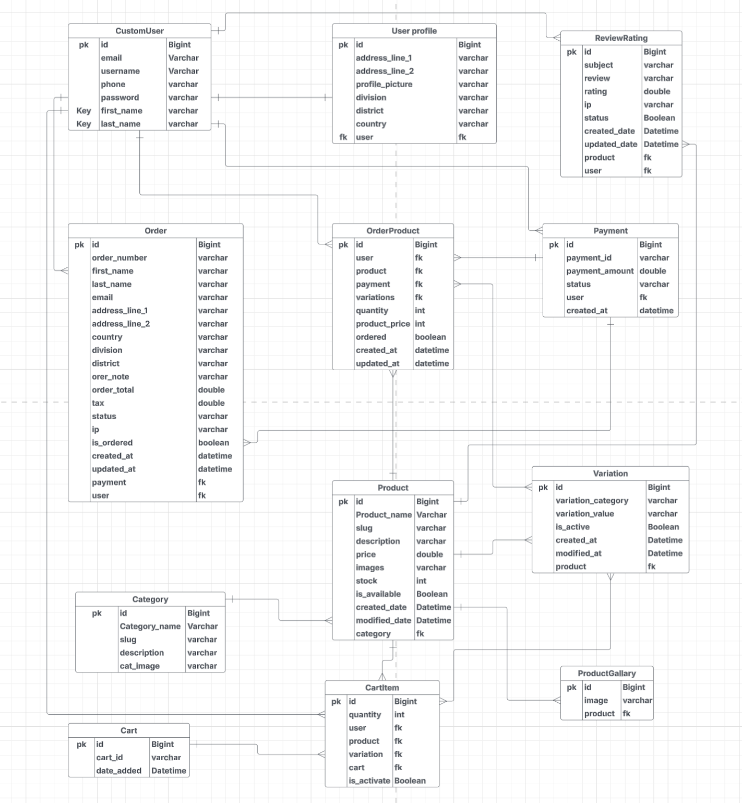

# 🛒 GreatKart — Django E-Commerce Platform

GreatKart is a full-featured e-commerce platform built with **Django**  offering secure online shopping, user authentication, cart management, and payment processing via **SSLCommerz**.

---

## 🚀 Features

- User registration, login, logout, email verification
- Role-based dashboard (admin, customer)
- Category & product listing with detail views
- Search functionality (class-based and function-based views supported)
- Cart, checkout, and order placement
- Payment gateway integration via **SSLCommerz**
- Order history and detail view
- Profile edit and password reset
- Admin panel for managing products, orders, and users

---

## 🔐 Technologies Used

- **Python 3.12**
- **Django 5.x**
- **SSLCommerz** for payment
- **SQLite** (default; can be switched to PostgreSQL)
- **Bootstrap 5** (Frontend)
- **Pre-commit hooks** (Black, Isort, Flake8, YAML checks)

---
## 🗺️ Database Entity Relationship Diagram

<h3>Database ER Diagram</h3>

  

